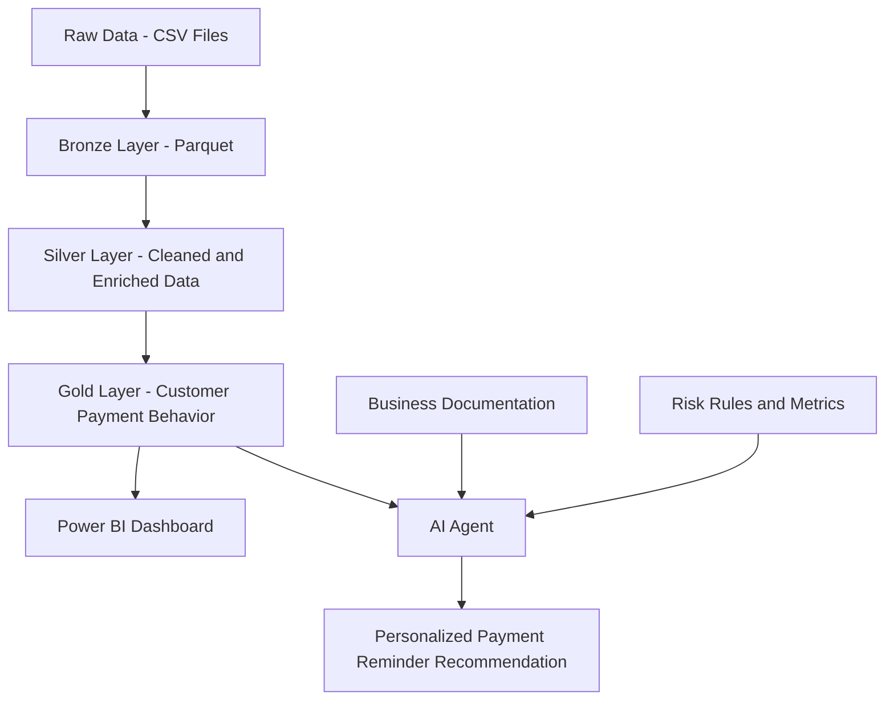

# AI-Powered Payment Reminder & Delinquency Prevention Platform

## Visão Geral

Este projeto tem como objetivo criar uma solução de Engenharia de Dados e Analytics para identificar clientes com maior risco de atraso no pagamento e apoiar estratégias de lembrete preventivo antes do vencimento.

A proposta é transformar dados brutos de pagamentos em uma base analítica confiável, capaz de alimentar dashboards no Power BI e, futuramente, um agente de IA com RAG para recomendar ações personalizadas de comunicação.

---

## Problema de Negócio

Empresas financeiras precisam reduzir atrasos de pagamento e prevenir inadimplência. Enviar o mesmo lembrete para todos os clientes pode ser pouco eficiente, pois clientes possuem comportamentos de pagamento diferentes.

A pergunta central do projeto é:

> Como identificar clientes com maior risco de atraso e acionar lembretes preventivos antes do vencimento?

---

## Arquitetura do Projeto

O projeto foi estruturado em camadas:

```text
data/
├── raw
├── bronze
├── silver
└── gold
```

### Raw

Camada com os arquivos originais em CSV.

### Bronze

Camada com os dados convertidos para Parquet, preservando a estrutura original.

### Silver

Camada com dados tratados, padronizados e enriquecidos com regras de negócio.

### Gold

Camada analítica consolidada por cliente, com métricas de comportamento de pagamento e classificação de risco.

---

---
## Arquitetura da Solução

A solução foi pensada como uma plataforma analítica em camadas, partindo dos dados brutos até o consumo por áreas de negócio e, futuramente, por um agente de IA.



### Fluxo da solução

1. **Raw**
   Armazena os arquivos originais em CSV.

2. **Bronze**
   Converte os dados brutos para Parquet, preservando a estrutura original.

3. **Silver**
   Aplica padronização, renomeia colunas, cria regras de negócio e identifica inconsistências.

4. **Gold**
   Consolida os dados por cliente e cria métricas analíticas para classificação de risco.

5. **Power BI**
   Camada de visualização para acompanhamento dos indicadores de risco, atraso e comportamento de pagamento.

6. **AI Agent / RAG**
   Camada futura para responder perguntas de negócio e recomendar estratégias de lembrete com base em dados tratados e documentação do projeto.

---

## Power BI Layer

A camada Gold será utilizada como fonte principal para criação de um dashboard no Power BI.

Arquivo de entrada:

```text
data/gold/gold_customer_payment_behavior.parquet
```

Indicadores planejados:

* total de clientes analisados;
* clientes por nível de risco;
* percentual de clientes `HIGH_RISK`;
* distribuição por perfil de comportamento de pagamento;
* média de atraso por grupo de risco;
* clientes com maior atraso histórico;
* volume de clientes elegíveis para lembrete preventivo.

O objetivo do dashboard é permitir que a área de negócio visualize rapidamente quais grupos de clientes exigem maior atenção antes do vencimento.

---

## AI Agent, RAG and LLM Layer

A camada de IA será utilizada para transformar os dados tratados e a documentação do projeto em respostas de negócio mais contextualizadas.

A proposta é que o agente consiga responder perguntas como:

```text
Por que este cliente foi classificado como HIGH_RISK?
```

```text
Qual estratégia de lembrete é mais adequada para clientes MEDIUM_RISK?
```

```text
Quais fatores contribuíram para o risco de atraso?
```

```text
Qual mensagem preventiva poderia ser enviada para este cliente?
```

### Papel do RAG

O RAG será usado para recuperar informações relevantes da documentação do projeto, como:

* regras de classificação de risco;
* definição das métricas;
* explicação das camadas Bronze, Silver e Gold;
* critérios de negócio para lembretes preventivos.

Com isso, o agente de IA poderá gerar respostas mais rastreáveis e alinhadas às regras do projeto.

### Papel do LLM

O LLM será responsável por interpretar a pergunta do usuário, consultar o contexto recuperado pelo RAG e gerar uma resposta em linguagem natural.

Exemplo de resposta esperada:

```text
Este cliente foi classificado como HIGH_RISK porque possui alta taxa de atraso e já apresentou atraso máximo superior a 30 dias. Para esse perfil, recomenda-se envio de lembrete antecipado, com reforço próximo ao vencimento.
```

---

## Roadmap do Projeto

### Concluído

* Entendimento do problema de negócio.
* Catálogo inicial dos dados.
* Dicionário de dados.
* Arquitetura Raw, Bronze, Silver e Gold.
* Pipeline Raw para Bronze.
* Pipeline Bronze para Silver.
* Pipeline Silver para Gold.
* Validação das camadas Bronze, Silver e Gold.
* Documentação das métricas da Gold.
* Publicação inicial no GitHub.

### Em desenvolvimento

* Dashboard no Power BI.
* Documentação visual da arquitetura.
* Design do agente de IA.
* Implementação de RAG com documentação do projeto.
* Criação de prompts para recomendação de lembretes preventivos.

### Próximas entregas

* Criar dashboard com indicadores de risco.
* Criar pasta `dashboard/` com prints ou arquivo `.pbix`.
* Criar documentação do agente em `docs/06_ia_agent_design.md`.
* Criar protótipo do agente em `ia_agents/`.
* Atualizar o README com imagens do dashboard.

---

## Stack Utilizada

* Python
* DuckDB
* Parquet
* VS Code
* Power BI
* OpenAI
* RAG
* GitHub

---

## Principal Regra de Negócio

A principal métrica criada foi `days_delay`.

```text
days_delay = actual_payment_day_offset - scheduled_payment_day_offset
```

Interpretação:

|      Resultado | Significado             |
| -------------: | ----------------------- |
| days_delay < 0 | Pagamento antecipado    |
| days_delay = 0 | Pagamento no vencimento |
| days_delay > 0 | Pagamento atrasado      |

---

## Resultado da Camada Silver

A camada Silver classificou os pagamentos em:

| Status               |     Total |
| -------------------- | --------: |
| PAID_EARLY           | 9.309.477 |
| PAID_ON_TIME         | 3.146.350 |
| PAID_LATE            | 1.146.669 |
| UNKNOWN_PAYMENT_DATE |     2.905 |

Taxa geral de atraso encontrada:

```text
8,43%
```

---

## Resultado da Camada Gold

A camada Gold consolidou o comportamento de pagamento por cliente.

Total de clientes analisados:

```text
339.587
```

Distribuição por nível de risco:

| Risk Level   | Total de Clientes |
| ------------ | ----------------: |
| LOW_RISK     |           210.109 |
| MEDIUM_RISK  |            92.276 |
| HIGH_RISK    |            37.193 |
| UNKNOWN_RISK |                 9 |

---

## Tabela Analítica Final

Arquivo final da camada Gold:

```text
data/gold/gold_customer_payment_behavior.parquet
```

Essa tabela possui uma linha por cliente e contém métricas como:

* total de parcelas;
* total de pagamentos atrasados;
* taxa de atraso;
* média de dias de atraso;
* maior atraso registrado;
* perfil de comportamento de pagamento;
* nível de risco.

---

## Possíveis Usos

A solução pode ser utilizada para:

* criar dashboards no Power BI;
* segmentar clientes por risco;
* apoiar estratégias de lembrete preventivo;
* priorizar clientes com maior probabilidade de atraso;
* alimentar um agente de IA com contexto de negócio e dados tratados.

---

## Próximos Passos

* Criar dashboard no Power BI.
* Criar indicadores visuais por nível de risco.
* Desenvolver documentação do agente de IA.
* Implementar RAG para responder perguntas com base nas regras do projeto.
* Publicar o projeto no GitHub.
