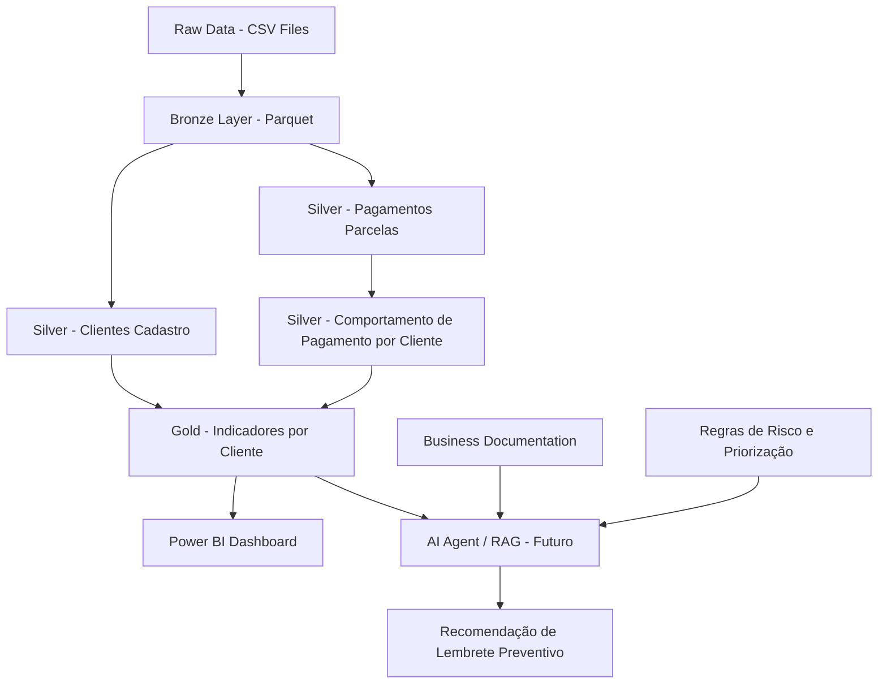

# AI-Powered Payment Reminder & Delinquency Prevention Platform

## Visão Geral

Este projeto nasceu a partir de uma pergunta de negócio sobre como a área de dados pode apoiar ações preventivas antes que o atraso aconteça:

> Como identificar clientes com maior risco de atraso e acionar lembretes preventivos antes do vencimento?

A partir dessa pergunta, foi construída uma solução de Engenharia de Dados e Analytics com foco em transformar dados brutos de pagamentos e cadastro de clientes em uma base analítica confiável, organizada em camadas Raw, Bronze, Silver e Gold.

O projeto cria um pipeline rastreável, padronizado e orientado ao negócio, gerando métricas como atraso de pagamento, taxa de atraso por cliente, perfil de comportamento, nível de risco, prioridade de contato e ação recomendada.

A camada Gold final pode ser utilizada em dashboards no Power BI e, futuramente, como base para um agente de IA com RAG capaz de responder perguntas sobre o comportamento dos clientes e sugerir estratégias de lembrete preventivo.

---

## Problema de Negócio

Empresas financeiras precisam reduzir atrasos de pagamento e prevenir inadimplência. Enviar o mesmo lembrete para todos os clientes pode ser pouco eficiente, pois clientes possuem comportamentos diferentes de pagamento.

A pergunta central do projeto é:

> Como identificar clientes com maior risco de atraso e priorizar ações de lembrete preventivo antes do vencimento?

A solução proposta permite segmentar clientes por risco, comportamento de pagamento e prioridade de contato, apoiando ações mais direcionadas para a área de negócio.

---

## Arquitetura do Projeto

O projeto segue uma arquitetura medalhão:

```text
data/
├── raw
├── bronze
├── silver
└── gold
```

### Raw

Camada com os arquivos originais em CSV.

Arquivos utilizados:

```text
application_train.csv
installments_payments.csv
```

### Bronze

Camada com os dados convertidos para Parquet, mantendo estrutura próxima da origem para preservar rastreabilidade.

Arquivos gerados:

```text
bronze_clientes_cadastro.parquet
bronze_pagamentos_parcelas.parquet
```

### Silver

Camada com dados tratados, padronizados, enriquecidos e validados.

Arquivos gerados:

```text
silver_pagamentos_parcelas.parquet
silver_clientes_cadastro.parquet
silver_comportamento_pagamento_cliente.parquet
```

### Gold

Camada analítica final para consumo no Power BI e análise de negócio.

Arquivo gerado:

```text
gold_indicadores_cliente.parquet
```

---

## Arquitetura da Solução

A solução foi pensada como uma plataforma analítica em camadas, partindo dos dados brutos até o consumo por áreas de negócio e, futuramente, por um agente de IA.



### Fluxo da solução

1. **Raw**
   Armazena os arquivos originais em CSV.

2. **Bronze**
   Converte os dados brutos para Parquet, preservando a estrutura original.

3. **Silver de pagamentos**
   Padroniza o histórico de pagamentos, cria status de pagamento, flags de atraso, antecipação, nulos críticos e diferenças financeiras.

4. **Silver de clientes**
   Padroniza o cadastro de clientes, traduz campos categóricos, cria variáveis de perfil e flags de qualidade.

5. **Silver de comportamento por cliente**
   Consolida o histórico de pagamentos em nível de cliente, criando taxa de atraso, maior atraso, perfil de pagamento e nível de risco.

6. **Gold de indicadores por cliente**
   Junta comportamento de pagamento com cadastro de clientes, cria prioridade de contato, ação recomendada, canal sugerido e grupo de negócio.

7. **Power BI**
   Camada de visualização dos indicadores de risco, prioridade, comportamento de pagamento e cobertura cadastral.

8. **AI Agent / RAG**
   Camada futura para responder perguntas de negócio e recomendar estratégias de lembrete com base nos dados tratados e documentação do projeto.

---

## Pipeline de Scripts

| Etapa | Script                                       | Descrição                                                       |
| ----- | -------------------------------------------- | --------------------------------------------------------------- |
| 01    | `01_origem_para_bronze.py`                   | Converte os arquivos CSV da camada Raw para Parquet na Bronze   |
| 02    | `02_validar_bronze_arquivos.py`              | Valida existência, volume, schema e amostra dos arquivos Bronze |
| 03    | `03_bronze_para_silver_pagamentos.py`        | Trata histórico de pagamentos e cria a Silver de pagamentos     |
| 04    | `04_validar_silver_pagamentos.py`            | Valida a Silver de pagamentos                                   |
| 05    | `05_bronze_para_silver_clientes.py`          | Trata cadastro de clientes e cria a Silver de clientes          |
| 06    | `06_validar_silver_clientes.py`              | Valida a Silver de clientes                                     |
| 07    | `07_criar_silver_comportamento_cliente.py`   | Consolida comportamento de pagamento por cliente                |
| 08    | `08_validar_silver_comportamento_cliente.py` | Valida a Silver de comportamento por cliente                    |
| 09    | `09_criar_gold_indicadores_cliente.py`       | Cria a Gold final de indicadores por cliente                    |
| 10    | `10_validar_gold_indicadores_cliente.py`     | Valida a Gold final                                             |

---

## Principal Regra de Negócio

A principal regra de pagamento compara o dia real do pagamento com o dia previsto de vencimento.

```text
dif_dias_vencimento = dias_pagamento_ref - dias_previsto_ref
```

Interpretação:

|                 Resultado | Significado          |
| ------------------------: | -------------------- |
| `dif_dias_vencimento < 0` | Pagamento antecipado |
| `dif_dias_vencimento = 0` | Pagamento no prazo   |
| `dif_dias_vencimento > 0` | Pagamento em atraso  |

A partir dessa regra, foram criados campos específicos para evitar distorções nos indicadores:

```text
dias_atraso
dias_antecipacao
status_pagamento
flg_pagamento_atrasado
flg_pagamento_antecipado
flg_pagamento_no_prazo
```

---

## Resultado da Silver de Pagamentos

A Silver de pagamentos possui 13.605.401 registros.

Distribuição por status de pagamento:

| Status de pagamento      |     Total |
| ------------------------ | --------: |
| pago_antecipado          | 9.309.477 |
| pago_no_prazo            | 3.146.350 |
| pago_em_atraso           | 1.146.669 |
| sem_pagamento_registrado |     2.905 |

Taxa geral de atraso encontrada:

```text
8,43%
```

A validação confirmou:

```text
0 inconsistências de atraso
0 inconsistências de antecipação
0 inconsistências de prazo
0 valores categóricos com maiúscula
0 valores financeiros negativos
```

---

## Resultado da Silver de Clientes

A Silver de clientes possui 307.511 registros e 307.511 clientes distintos.

A validação confirmou:

```text
0 registros duplicados
todas as colunas esperadas existem
nenhuma coluna extra
colunas em minúsculo e snake_case
campos categóricos em caixa baixa
flags binárias sem inconsistência
0 valores financeiros negativos
```

Pontos de atenção tratados por flags:

```text
12 registros com nulo crítico
12 nulos em valor_anuidade
```

---

## Resultado da Silver de Comportamento por Cliente

A Silver de comportamento por cliente consolida os pagamentos em nível de cliente.

Total de clientes com comportamento de pagamento:

```text
339.587
```

Distribuição por nível de risco:

| Nível de risco     | Total de clientes |
| ------------------ | ----------------: |
| baixo_risco        |           210.109 |
| medio_risco        |            92.276 |
| alto_risco         |            37.193 |
| risco_desconhecido |                 9 |

Distribuição por perfil de pagamento:

| Perfil de pagamento        | Total de clientes |
| -------------------------- | ----------------: |
| pagador_antecipado         |           151.500 |
| baixo_atraso               |            87.939 |
| atraso_moderado            |            71.455 |
| alto_atraso                |            20.451 |
| pagador_no_prazo           |             8.233 |
| comportamento_desconhecido |                 9 |

A validação também mediu a cobertura com a Silver de clientes:

```text
clientes_com_cadastro: 291.643
clientes_sem_cadastro: 47.944
pct_clientes_com_cadastro: 85,88%
```

---

## Resultado da Camada Gold

A camada Gold final consolida comportamento de pagamento, cadastro de clientes e regras de priorização de contato.

Arquivo final:

```text
data/gold/gold_indicadores_cliente.parquet
```

Total de clientes na Gold:

```text
339.587
```

Cobertura cadastral:

| Status de cadastro   | Total de clientes |
| -------------------- | ----------------: |
| cliente_com_cadastro |           291.643 |
| cliente_sem_cadastro |            47.944 |

Clientes priorizados para contato:

```text
129.478
```

Distribuição por nível de risco:

| Nível de risco     | Clientes | Priorizados |
| ------------------ | -------: | ----------: |
| baixo_risco        |  210.109 |           0 |
| medio_risco        |   92.276 |      92.276 |
| alto_risco         |   37.193 |      37.193 |
| risco_desconhecido |        9 |           9 |

Distribuição por prioridade de contato:

| Prioridade de contato | Total de clientes |
| --------------------- | ----------------: |
| prioridade_baixa      |           210.109 |
| prioridade_media      |            92.276 |
| prioridade_maxima     |            23.707 |
| prioridade_alta       |            13.486 |
| prioridade_revisao    |                 9 |

Distribuição por ação recomendada:

| Ação recomendada              | Total de clientes |
| ----------------------------- | ----------------: |
| comunicacao_relacionamento    |           151.500 |
| lembrete_preventivo_padrao    |            92.276 |
| lembrete_suave                |            58.609 |
| lembrete_preventivo_reforcado |            37.193 |
| revisar_dados_pagamento       |                 9 |

---

## Decisão de Modelagem da Gold

A Gold foi construída partindo da Silver de comportamento de pagamento, mantendo todos os clientes com histórico de pagamento.

A Silver de cadastro entra como enriquecimento por meio de `LEFT JOIN`.

Essa decisão evita perda de clientes que possuem histórico de pagamento, mas não aparecem no cadastro. Para esses casos, a Gold sinaliza:

```text
flg_cliente_com_cadastro = 0
status_cadastro = cliente_sem_cadastro
```

Para clientes encontrados no cadastro:

```text
flg_cliente_com_cadastro = 1
status_cadastro = cliente_com_cadastro
```

---

## Indicadores da Gold

A tabela Gold possui uma linha por cliente e contém campos como:

```text
id_cliente
nivel_risco
perfil_pagamento
taxa_atraso_pct
maior_atraso_dias
valor_previsto_total
valor_pago_total
flg_cliente_com_cadastro
status_cadastro
faixa_idade
faixa_renda
canal_sugerido
prioridade_contato
flg_priorizar_contato
acao_recomendada
grupo_negocio
valor_previsto_total_priorizado
```

---

## Power BI Layer

A camada Gold será utilizada como fonte principal para criação de um dashboard no Power BI.

Arquivo de entrada:

```text
data/gold/gold_indicadores_cliente.parquet
```

Indicadores sugeridos para o dashboard:

* total de clientes analisados;
* clientes por nível de risco;
* clientes por prioridade de contato;
* clientes por ação recomendada;
* clientes com e sem cadastro;
* percentual de clientes priorizados;
* valor previsto total priorizado;
* distribuição por perfil de pagamento;
* distribuição por faixa de renda;
* distribuição por faixa etária;
* canal sugerido para contato;
* clientes de alto risco com maior atraso histórico.

O objetivo do dashboard é permitir que a área de negócio visualize rapidamente quais grupos de clientes exigem maior atenção antes do vencimento.

---

## AI Agent, RAG and LLM Layer

A camada de IA será utilizada futuramente para transformar os dados tratados e a documentação do projeto em respostas de negócio mais contextualizadas.

A proposta é que o agente consiga responder perguntas como:

```text
Por que este cliente foi classificado como alto_risco?
```

```text
Qual estratégia de lembrete é mais adequada para clientes de medio_risco?
```

```text
Quais fatores contribuíram para o risco de atraso?
```

```text
Qual mensagem preventiva poderia ser enviada para este cliente?
```

### Papel do RAG

O RAG será usado para recuperar informações relevantes da documentação do projeto, como:

* regras de classificação de risco;
* definição das métricas;
* explicação das camadas Bronze, Silver e Gold;
* critérios de negócio para lembretes preventivos;
* dicionário de dados da Gold.

Com isso, o agente de IA poderá gerar respostas mais rastreáveis e alinhadas às regras do projeto.

### Papel do LLM

O LLM será responsável por interpretar a pergunta do usuário, consultar o contexto recuperado pelo RAG e gerar uma resposta em linguagem natural.

Exemplo de resposta esperada:

```text
Este cliente foi classificado como alto_risco porque possui alta taxa de atraso e já apresentou atraso máximo superior a 30 dias. Para esse perfil, recomenda-se envio de lembrete preventivo reforçado antes do vencimento.
```

---

## Stack Utilizada

* Python
* DuckDB
* Parquet
* VS Code
* Power BI
* Git
* GitHub
* OpenAI
* RAG

---

## Estrutura Principal do Projeto

```text
data/
├── raw/
├── bronze/
├── silver/
└── gold/

scripts/
├── 01_origem_para_bronze.py
├── 02_validar_bronze_arquivos.py
├── 03_bronze_para_silver_pagamentos.py
├── 04_validar_silver_pagamentos.py
├── 05_bronze_para_silver_clientes.py
├── 06_validar_silver_clientes.py
├── 07_criar_silver_comportamento_cliente.py
├── 08_validar_silver_comportamento_cliente.py
├── 09_criar_gold_indicadores_cliente.py
└── 10_validar_gold_indicadores_cliente.py
```

---

## Roadmap do Projeto

### Concluído

* Entendimento do problema de negócio;
* Estruturação da arquitetura Raw, Bronze, Silver e Gold;
* Pipeline Raw para Bronze;
* Validação da Bronze;
* Pipeline Bronze para Silver de pagamentos;
* Validação da Silver de pagamentos;
* Pipeline Bronze para Silver de clientes;
* Validação da Silver de clientes;
* Criação da Silver de comportamento por cliente;
* Validação da Silver de comportamento;
* Criação da Gold de indicadores por cliente;
* Validação da Gold final;
* Publicação inicial no GitHub.

### Em desenvolvimento

* Dashboard no Power BI;
* Documentação visual da arquitetura;
* Dicionário de dados da Gold;
* Design do agente de IA;
* Implementação futura de RAG com documentação do projeto.

### Próximas entregas

* Criar dashboard com indicadores de risco, prioridade e ação recomendada;
* Criar pasta `dashboard/` com prints ou arquivo `.pbix`;
* Criar documentação do agente em `docs/06_desenho_agente_ia.md`;
* Criar protótipo do agente em `ia_agents/`;
* Atualizar o README com imagens do dashboard.

---

## Possíveis Usos

A solução pode ser utilizada para:

* criar dashboards no Power BI;
* segmentar clientes por risco;
* apoiar estratégias de lembrete preventivo;
* priorizar clientes com maior probabilidade de atraso;
* identificar cobertura cadastral dos clientes com histórico de pagamento;
* apoiar ações de relacionamento com clientes de baixo risco;
* alimentar um agente de IA com contexto de negócio e dados tratados.

---
