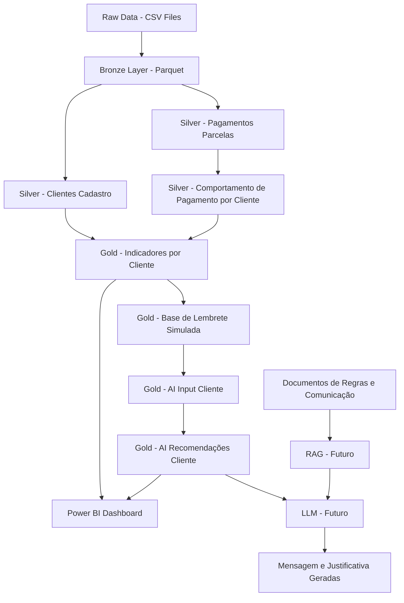

# Priorização de Clientes para Lembretes de Pagamento

## Visão Geral

Este projeto nasceu a partir de uma pergunta de negócio sobre como a área de dados pode apoiar ações preventivas antes que o atraso aconteça:

> Como identificar clientes com maior risco de atraso e acionar lembretes preventivos antes do vencimento?

A partir dessa pergunta, foi construída uma solução de Engenharia de Dados e Analytics com foco em transformar dados brutos de pagamentos e cadastro de clientes em uma base analítica confiável, organizada em camadas Raw, Bronze, Silver e Gold.

Com a evolução do projeto, a solução passou a incorporar também uma camada inteligente de priorização e recomendação operacional, capaz de combinar prazo para vencimento, risco de atraso, histórico de pagamento e elegibilidade para automação.

Atualmente, o projeto entrega:

- pipeline rastreável e padronizado de dados
- base analítica final para consumo no Power BI
- dashboard executivo para análise de vencimento, risco e estratégia de contato
- camada inteligente de decisão para priorização de clientes
- recomendação operacional com prioridade, ação sugerida, canal e status de automação

Como evolução futura, a solução poderá incorporar LLM e RAG para geração textual e apoio adicional à tomada de decisão.

## Objetivo

Desenvolver uma solução analítica para priorizar clientes em ações de lembrete de pagamento, considerando risco de atraso, prazo para vencimento, comportamento histórico e regras de elegibilidade para contato automático.

---

## Problema de Negócio

Empresas financeiras precisam reduzir atrasos de pagamento e prevenir inadimplência. Enviar o mesmo lembrete para todos os clientes pode ser pouco eficiente, pois clientes possuem comportamentos diferentes de pagamento.

A pergunta central do projeto é:

> Como identificar clientes com maior risco de atraso e priorizar ações de lembrete preventivo antes do vencimento?

A solução proposta permite segmentar clientes por risco, comportamento de pagamento e prioridade de contato, apoiando ações mais direcionadas para a área de negócio.

---

## Arquitetura do Projeto

O projeto segue uma arquitetura medalhão:

```text
data/
├── raw
├── bronze
├── silver
└── gold
```

### Raw

Camada com os arquivos originais em CSV.

Arquivos utilizados:

```text
application_train.csv
installments_payments.csv
```

### Bronze

Camada com os dados convertidos para Parquet, mantendo estrutura próxima da origem para preservar rastreabilidade.

Arquivos gerados:

```text
bronze_clientes_cadastro.parquet
bronze_pagamentos_parcelas.parquet
```

### Silver

Camada com dados tratados, padronizados, enriquecidos e validados.

Arquivos gerados:

```text
silver_pagamentos_parcelas.parquet
silver_clientes_cadastro.parquet
silver_comportamento_pagamento_cliente.parquet
```

### Gold

Camada analítica final para consumo no Power BI, priorização operacional e apoio à camada inteligente.

Arquivos gerados:

```text
gold_indicadores_cliente.parquet
gold_base_lembrete_vencimento_simulada.parquet
gold_ai_input_cliente.parquet
gold_ai_recomendacoes_cliente.parquet
```

---

## Arquitetura da Solução

A solução foi pensada como uma arquitetura analítica em camadas, partindo dos dados brutos até a recomendação operacional final, com evolução futura para LLM, RAG e agente de IA.



### Fluxo da solução

1. **Raw**  
   Armazena os arquivos originais em CSV.

2. **Bronze**  
   Converte os dados brutos para Parquet, preservando a estrutura original.

3. **Silver de pagamentos**  
   Padroniza o histórico de pagamentos, cria status de pagamento, flags de atraso, antecipação, nulos críticos e diferenças financeiras.

4. **Silver de clientes**  
   Padroniza o cadastro de clientes, traduz campos categóricos, cria variáveis de perfil e flags de qualidade.

5. **Silver de comportamento por cliente**  
   Consolida o histórico de pagamentos em nível de cliente, criando taxa de atraso, maior atraso, perfil de pagamento e nível de risco.

6. **Gold de indicadores por cliente**  
   Junta comportamento de pagamento com cadastro de clientes e cria indicadores analíticos para consumo de negócio.

7. **Gold de lembrete operacional**  
   Gera a base simulada para priorização de lembretes de pagamento, com foco em prazo, risco, elegibilidade e ação sugerida.

8. **Camada inteligente de priorização**  
   Consolida a entrada da camada inteligente e gera a recomendação operacional final com prioridade, canal, ação recomendada e status da automação.

9. **Power BI**  
   Camada de visualização dos indicadores de risco, prioridade, comportamento de pagamento, elegibilidade e recomendação operacional.

10. **LLM / RAG / Agente**  
    Camada futura para geração textual, recuperação de regras e orquestração ponta a ponta da recomendação.

---

## Camadas Analíticas Finais

Na etapa atual do projeto, a camada Gold passou a conter não apenas indicadores históricos do cliente, mas também a base de priorização operacional e a entrada consolidada da camada inteligente.

### Principais saídas analíticas

- `gold_indicadores_cliente.parquet`  
  Base histórica consolidada por cliente, com métricas como percentual de atraso, atraso médio, quantidade de não pagos e valor em aberto.

- `gold_base_lembrete_vencimento_simulada.parquet`  
  Base simulada com foco operacional, incluindo prazo para vencimento, faixa de vencimento, grupo de negócio, nível de risco, elegibilidade para envio, ação recomendada e mensagem sugerida.

- `gold_ai_input_cliente.parquet`  
  Base consolidada para consumo da camada inteligente, unindo dados atuais do lembrete com histórico de comportamento do cliente.

- `gold_ai_recomendacoes_cliente.parquet`  
  Base final da recomendação operacional, contendo prioridade final, status da automação, necessidade de revisão humana, canal sugerido e ação recomendada.

---

## Pipeline de Processamento

O pipeline do projeto foi estruturado em etapas progressivas de transformação e enriquecimento dos dados, desde a origem até a recomendação operacional final.

### Principais scripts do projeto

- `01_origem_para_bronze.py`  
  Leitura das bases originais e preparação inicial da camada Bronze.

- `03_bronze_para_silver_pagamentos.py`  
  Tratamento e padronização dos dados de pagamentos.

- `05_bronze_para_silver_clientes.py`  
  Tratamento e padronização dos dados cadastrais dos clientes.

- `09_criar_gold_indicadores_cliente.py`  
  Geração da base histórica consolidada por cliente.

- `11_criar_gold_base_lembrete_vencimento_simulada.py`  
  Geração da base operacional simulada para priorização de lembretes de pagamento.

- `06_gold_to_ai_input_cliente.py`  
  Consolidação da entrada da camada inteligente, unindo a base operacional atual com o histórico do cliente.

- `07_gerar_recomendacoes_ia_cliente.py`  
  Geração da recomendação operacional final, incluindo prioridade, canal sugerido, ação recomendada e status da automação.

- `12_validar_gold_ai_recomendacoes_cliente.py`  
  Script de validação da base final de recomendações, incluindo conferência da linha de teste e amostras operacionais.

---

## Principal Regra de Negócio

A principal regra de pagamento compara o dia real do pagamento com o dia previsto de vencimento.

```text
dif_dias_vencimento = dias_pagamento_ref - dias_previsto_ref
```

Interpretação:

| Resultado | Significado |
|---------:|-------------|
| `dif_dias_vencimento < 0` | Pagamento antecipado |
| `dif_dias_vencimento = 0` | Pagamento no prazo |
| `dif_dias_vencimento > 0` | Pagamento em atraso |

A partir dessa regra, foram criados campos específicos para evitar distorções nos indicadores:

```text
dias_atraso
dias_antecipacao
status_pagamento
flg_pagamento_atrasado
flg_pagamento_antecipado
flg_pagamento_no_prazo
```

---

## Resultado da Silver de Pagamentos

A Silver de pagamentos possui 13.605.401 registros.

Distribuição por status de pagamento:

| Status de pagamento | Total |
|---------------------|------:|
| pago_antecipado | 9.309.477 |
| pago_no_prazo | 3.146.350 |
| pago_em_atraso | 1.146.669 |
| sem_pagamento_registrado | 2.905 |

Taxa geral de atraso encontrada:

```text
8,43%
```

A validação confirmou:

```text
0 inconsistências de atraso
0 inconsistências de antecipação
0 inconsistências de prazo
0 valores categóricos com maiúscula
0 valores financeiros negativos
```

---

## Resultado da Silver de Clientes

A Silver de clientes possui 307.511 registros e 307.511 clientes distintos.

A validação confirmou:

```text
0 registros duplicados
todas as colunas esperadas existem
nenhuma coluna extra
colunas em minúsculo e snake_case
campos categóricos em caixa baixa
flags binárias sem inconsistência
0 valores financeiros negativos
```

Pontos de atenção tratados por flags:

```text
12 registros com nulo crítico
12 nulos em valor_anuidade
```

---

## Resultado da Silver de Comportamento por Cliente

A Silver de comportamento por cliente consolida os pagamentos em nível de cliente.

Total de clientes com comportamento de pagamento:

```text
339.587
```

Distribuição por nível de risco:

| Nível de risco | Total de clientes |
|----------------|------------------:|
| baixo_risco | 210.109 |
| medio_risco | 92.276 |
| alto_risco | 37.193 |
| risco_desconhecido | 9 |

Distribuição por perfil de pagamento:

| Perfil de pagamento | Total de clientes |
|---------------------|------------------:|
| pagador_antecipado | 151.500 |
| baixo_atraso | 87.939 |
| atraso_moderado | 71.455 |
| alto_atraso | 20.451 |
| pagador_no_prazo | 8.233 |
| comportamento_desconhecido | 9 |

A validação também mediu a cobertura com a Silver de clientes:

```text
clientes_com_cadastro: 291.643
clientes_sem_cadastro: 47.944
pct_clientes_com_cadastro: 85,88%
```

---

## Resultado da Camada Gold

A camada Gold final consolida comportamento de pagamento, cadastro de clientes, priorização operacional e bases de consumo da camada inteligente.

Arquivos finais:

```text
data/gold/gold_indicadores_cliente.parquet
data/gold/gold_base_lembrete_vencimento_simulada.parquet
data/gold/gold_ai_input_cliente.parquet
data/gold/gold_ai_recomendacoes_cliente.parquet
```

Total de clientes na base final de recomendação:

```text
339.587
```

Cobertura cadastral:

| Status de cadastro | Total de clientes |
|--------------------|------------------:|
| cliente_com_cadastro | 291.643 |
| cliente_sem_cadastro | 47.944 |

Clientes por status da automação:

| Status da automação | Total de clientes |
|---------------------|------------------:|
| pronto_para_acionamento | 291.635 |
| bloqueado | 47.952 |

Distribuição por prioridade final:

| Prioridade final | Total de clientes |
|------------------|------------------:|
| media | 147.202 |
| baixa | 71.645 |
| media_alta | 61.861 |
| bloqueada | 47.952 |
| alta | 10.927 |

Distribuição por ação recomendada pela camada inteligente:

| Ação recomendada | Total de clientes |
|------------------|------------------:|
| lembrete_suave | 167.212 |
| lembrete_preventivo | 61.861 |
| contato_relacional | 51.635 |
| revisao_cadastral | 47.944 |
| lembrete_reforcado | 10.927 |
| revisao_regra_risco | 8 |

---

## Decisão de Modelagem da Gold

A Gold foi construída partindo da Silver de comportamento de pagamento, mantendo todos os clientes com histórico de pagamento.

A Silver de cadastro entra como enriquecimento por meio de `LEFT JOIN`.

Essa decisão evita perda de clientes que possuem histórico de pagamento, mas não aparecem no cadastro. Para esses casos, a Gold sinaliza:

```text
flg_cliente_com_cadastro = 0
status_cadastro = cliente_sem_cadastro
```

Para clientes encontrados no cadastro:

```text
flg_cliente_com_cadastro = 1
status_cadastro = cliente_com_cadastro
```

---

## Indicadores da Gold

A camada Gold passou a conter uma combinação de indicadores históricos, atributos operacionais e saídas da recomendação final.

Exemplos de campos utilizados:

```text
id_cliente
nivel_risco
perfil_pagamento
taxa_atraso_pct
maior_atraso_dias
valor_previsto_total
valor_pago_total
flg_cliente_com_cadastro
status_cadastro
faixa_idade
faixa_renda
canal_sugerido
prioridade_contato
flg_priorizar_contato
acao_recomendada
grupo_negocio
valor_previsto_total_priorizado
prioridade_final
status_automacao
necessita_revisao_humana
```

---

## Power BI Layer

A camada analítica do projeto é utilizada como fonte para criação do dashboard executivo em Power BI.

Principais bases consumidas:

```text
data/gold/gold_indicadores_cliente.parquet
data/gold/gold_base_lembrete_vencimento_simulada.parquet
```

Indicadores sugeridos para o dashboard:

- total de clientes analisados
- clientes por nível de risco
- clientes por prioridade de contato
- clientes por ação recomendada
- clientes com e sem cadastro
- percentual de clientes priorizados
- valor previsto total priorizado
- distribuição por perfil de pagamento
- distribuição por faixa de renda
- distribuição por faixa etária
- canal sugerido para contato
- clientes de alto risco com maior atraso histórico

O objetivo do dashboard é permitir que a área de negócio visualize rapidamente quais grupos de clientes exigem maior atenção antes do vencimento e quais estratégias de contato fazem mais sentido para cada perfil.

---

## Camada Inteligente de Priorização

Após a construção das camadas analíticas e do dashboard em Power BI, o projeto evoluiu para uma camada inteligente de decisão operacional.

Essa camada foi implementada para transformar a análise em ação prática, permitindo identificar quais clientes podem seguir para automação, quais precisam de revisão humana e qual abordagem faz mais sentido para cada perfil.

### O que essa camada entrega

- consolidação da entrada da camada inteligente em `gold_ai_input_cliente.parquet`
- geração da saída final de recomendação em `gold_ai_recomendacoes_cliente.parquet`
- definição de prioridade final por cliente
- definição de canal sugerido
- definição de ação recomendada
- definição do status da automação
- identificação de casos bloqueados para revisão humana

### Bases finais da camada inteligente

- `gold_ai_input_cliente.parquet`  
  Base consolidada de entrada da camada inteligente, reunindo dados atuais do lembrete e histórico do cliente.

- `gold_ai_recomendacoes_cliente.parquet`  
  Base final com recomendação operacional, incluindo prioridade final, canal sugerido, ação recomendada, status da automação e necessidade de revisão humana.

### Validação implementada

A camada inteligente foi validada por meio de:

- geração da base final de recomendações
- validação da linha de teste com cliente fictício
- conferência de amostras operacionais
- separação entre clientes prontos para acionamento e clientes bloqueados

### Exemplos de decisão da solução

A solução já consegue distinguir cenários como:

- clientes prontos para acionamento automático
- clientes bloqueados por ausência de cadastro válido
- clientes bloqueados por risco desconhecido
- clientes com maior prioridade por combinação de vencimento próximo e histórico de atraso

---

## AI Agent, RAG and LLM Layer

A etapa atual do projeto já implementa uma camada inteligente de recomendação operacional baseada em regras de negócio e dados históricos do cliente.

Nesta versão, a solução já é capaz de:

- priorizar clientes para lembretes de pagamento
- sugerir ação recomendada por perfil
- definir status da automação
- identificar casos que exigem revisão humana
- estruturar a base final para futura geração textual com LLM

### Estado atual da solução

Atualmente, a camada de decisão operacional está implementada em Python e gera saídas finais para apoio à operação, com foco em:

- prioridade final
- canal sugerido
- ação recomendada
- status de automação
- necessidade de revisão humana

### Evolução futura com LLM

Como próxima evolução, a solução poderá incorporar um modelo generativo para refinar:

- mensagem_sugerida_llm
- justificativa_llm

Nessa etapa futura, a IA generativa será utilizada para transformar a saída operacional em mensagens mais naturais e justificativas mais contextuais, mantendo a decisão principal ancorada em regras e dados estruturados.

### Evolução futura com RAG

A arquitetura poderá evoluir para uma abordagem com RAG, utilizando documentos de negócio como:

- política de comunicação
- regras de priorização
- tratamento de clientes bloqueados
- diretrizes de tom de mensagem

Esses documentos já começaram a ser estruturados na pasta `docs/rag/`, preparando a solução para respostas mais fundamentadas e alinhadas às regras do projeto.

### Evolução futura com agente de IA

Em uma etapa posterior, a solução poderá ser expandida para um agente de IA responsável por:

- consumir a base consolidada por cliente
- consultar regras e documentação
- gerar mensagem final
- justificar a recomendação
- apoiar a orquestração operacional da comunicação preventiva

---

## Stack Utilizada

### Tecnologias já utilizadas

- Python
- DuckDB
- Parquet
- VS Code
- Power BI
- Git
- GitHub

### Evolução futura prevista

- LLM
- RAG
- Agente de IA

---

## Estrutura Principal do Projeto

```text
data/
├── raw/
├── bronze/
├── silver/
└── gold/

docs/
└── rag/
    ├── 01_politica_comunicacao.md
    ├── 02_regras_priorizacao.md
    ├── 03_tratamento_clientes_bloqueados.md
    └── 04_tom_mensagem.md

scripts/
├── 01_origem_para_bronze.py
├── 02_validar_bronze_arquivos.py
├── 03_bronze_para_silver_pagamentos.py
├── 04_validar_silver_pagamentos.py
├── 05_bronze_para_silver_clientes.py
├── 06_validar_silver_clientes.py
├── 07_criar_silver_comportamento_cliente.py
├── 08_validar_silver_comportamento_cliente.py
├── 09_criar_gold_indicadores_cliente.py
├── 10_validar_gold_indicadores_cliente.py
├── 11_criar_gold_base_lembrete_vencimento_simulada.py
├── 06_gold_to_ai_input_cliente.py
├── 06_gold_validar_ia_input_cliente.py
├── 07_gerar_recomendacoes_ia_cliente.py
└── 12_validar_gold_ai_recomendacoes_cliente.py
```

---

## Roadmap do Projeto

A evolução do projeto foi organizada em etapas progressivas, partindo da engenharia de dados até a camada inteligente de recomendação operacional.

### Etapas já implementadas

- ingestão e padronização dos dados em camadas Raw, Bronze, Silver e Gold
- construção da base histórica consolidada por cliente
- criação da base simulada para priorização de lembretes de pagamento
- desenvolvimento do dashboard executivo em Power BI
- implementação da camada inteligente de decisão operacional
- geração das bases `gold_ai_input_cliente.parquet` e `gold_ai_recomendacoes_cliente.parquet`
- validação da recomendação final com cliente fictício e amostras operacionais

### Etapa atual

Na etapa atual, o projeto já é capaz de transformar dados históricos e operacionais em recomendações acionáveis para a régua de lembretes de pagamento, com foco em:

- priorização de clientes
- recomendação de ação
- sugestão de canal
- definição do status da automação
- identificação de casos que exigem revisão humana

### Próximas evoluções

Como evolução futura, o projeto poderá incorporar:

- geração textual com LLM para mensagens e justificativas
- uso de RAG para consulta de regras e documentação de negócio
- agente de IA para orquestração da recomendação ponta a ponta
- expansão da camada analítica com novos critérios de priorização
- publicação do dashboard em ambiente compartilhado

---

## Documentação Complementar

Para detalhar a evolução da solução, o projeto também possui documentos complementares:

- `docs/12_validacao_manual_casos.md`  
  Validação manual de cenários representativos da camada inteligente.

- `docs/13_desenho_rag_llm_agente.md`  
  Desenho futuro da solução com RAG, LLM e agente de IA.

- `docs/rag/01_politica_comunicacao.md`  
  Regras iniciais para comunicação preventiva.

- `docs/rag/02_regras_priorizacao.md`  
  Critérios de priorização operacional.

- `docs/rag/03_tratamento_clientes_bloqueados.md`  
  Tratamento esperado para casos bloqueados.

- `docs/rag/04_tom_mensagem.md`  
  Diretrizes para o tom da mensagem.

## Possíveis Usos

A solução desenvolvida neste projeto pode ser aplicada em diferentes contextos de negócio que dependem de priorização de clientes e comunicação preventiva.

### Aplicações diretas

- operações de lembrete de pagamento antes do vencimento
- priorização de clientes com maior risco de atraso
- identificação de casos elegíveis para automação
- separação de clientes que exigem revisão humana antes de qualquer contato
- apoio à régua de comunicação preventiva por perfil de cliente

### Aplicações analíticas

- análise do comportamento histórico de pagamento
- segmentação de clientes por risco de atraso
- construção de indicadores operacionais para cobrança preventiva
- apoio à tomada de decisão em áreas de dados, CRM e cobrança
- acompanhamento de clientes com vencimento próximo e maior criticidade

### Evoluções possíveis

A arquitetura do projeto também permite expansão para cenários como:

- geração textual de mensagens e justificativas com LLM
- uso de RAG para consulta de regras e políticas de negócio
- criação de agente de IA para orquestração operacional
- recomendação mais personalizada por canal, prazo e perfil
- integração com fluxos automatizados de comunicação

---
