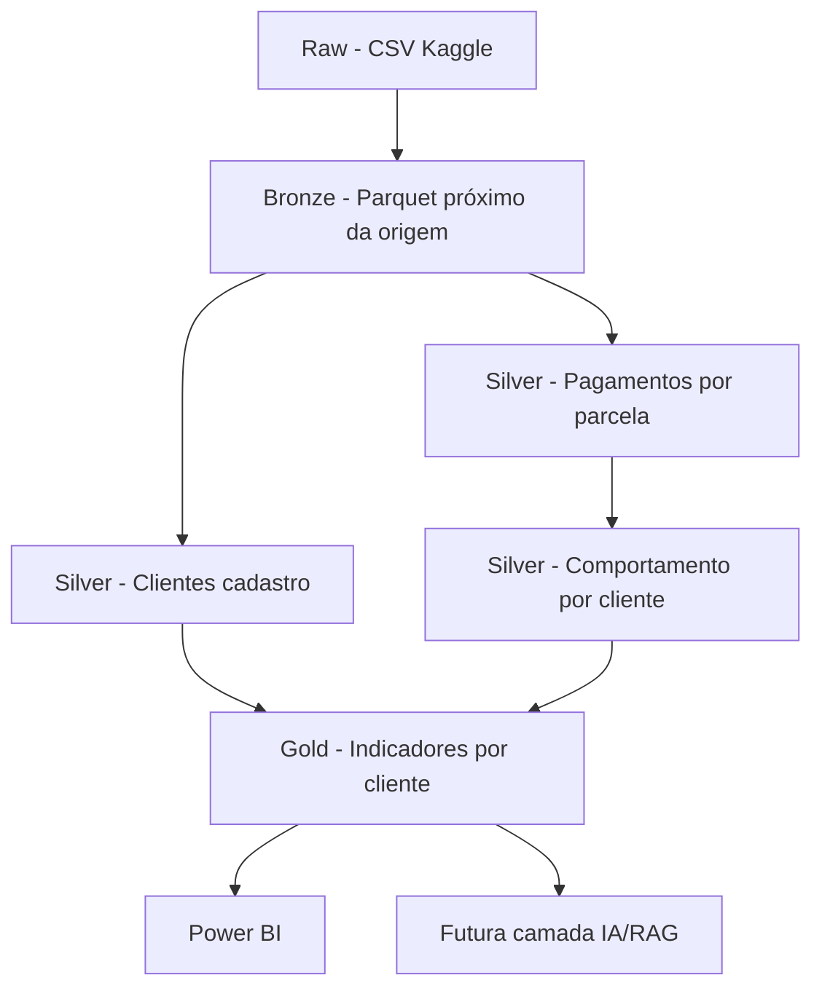

# Arquitetura do Projeto

Este documento descreve a arquitetura de dados do projeto **AI-Powered Payment Reminder & Delinquency Prevention Platform**.

O projeto foi construído com uma arquitetura em camadas, seguindo o padrão medalhão:

```text
raw
↓
bronze
↓
silver
↓
gold
```

O objetivo é transformar dados brutos de pagamentos e cadastro em uma camada final analítica capaz de apoiar decisões de negócio, Power BI e uma futura camada de IA/RAG.

---

## 1. Objetivo da Arquitetura

A arquitetura foi desenhada para responder à seguinte pergunta de negócio:

> Como identificar clientes com maior risco de atraso e priorizar ações de lembrete preventivo antes do vencimento?

Para isso, o projeto organiza os dados em etapas:

| Camada | Objetivo                                                              |
| ------ | --------------------------------------------------------------------- |
| Raw    | Armazenar os arquivos originais do dataset                            |
| Bronze | Converter os dados para Parquet, mantendo estrutura próxima da origem |
| Silver | Tratar, traduzir, padronizar e criar regras reutilizáveis             |
| Gold   | Consolidar indicadores finais para análise de negócio e Power BI      |

---

## 2. Visão Geral da Arquitetura



---

## 3. Camada Raw

A camada Raw armazena os arquivos originais do dataset, sem transformação.

Local:

```text
data/raw/
```

Arquivos utilizados:

```text
application_train.csv
installments_payments.csv
```

### `application_train.csv`

Contém dados cadastrais e características dos clientes, como renda, idade, tipo de contrato, escolaridade, moradia, ocupação e histórico de inadimplência.

### `installments_payments.csv`

Contém o histórico de parcelas e pagamentos, incluindo data prevista, data real de pagamento, valor previsto e valor pago.

---

## 4. Camada Bronze

A camada Bronze converte os arquivos Raw para Parquet.

Local:

```text
data/bronze/
```

Arquivos gerados:

```text
bronze_clientes_cadastro.parquet
bronze_pagamentos_parcelas.parquet
```

A Bronze mantém os dados próximos da origem. Por isso, nessa camada ainda podem existir nomes originais do dataset, como:

```text
SK_ID_CURR
DAYS_INSTALMENT
DAYS_ENTRY_PAYMENT
AMT_INSTALMENT
AMT_PAYMENT
```

Essa decisão preserva rastreabilidade entre o dado original e as próximas transformações.

---

## 5. Camada Silver

A camada Silver é responsável por padronizar, traduzir e enriquecer os dados.

Local:

```text
data/silver/
```

Arquivos gerados:

```text
silver_pagamentos_parcelas.parquet
silver_clientes_cadastro.parquet
silver_comportamento_pagamento_cliente.parquet
```

---

## 6. Silver de Pagamentos por Parcela

Arquivo:

```text
data/silver/silver_pagamentos_parcelas.parquet
```

Granularidade:

```text
1 linha = 1 parcela/pagamento de um cliente
```

Essa tabela é criada a partir de:

```text
data/bronze/bronze_pagamentos_parcelas.parquet
```

Principais transformações:

* tradução dos nomes das colunas para português;
* padronização em minúsculo e `snake_case`;
* cálculo da diferença entre pagamento e vencimento;
* criação de flags de atraso, antecipação e pagamento no prazo;
* classificação do status do pagamento;
* classificação do status do valor pago;
* identificação de registros com nulos críticos.

Regra principal:

```text
dif_dias_vencimento = dias_pagamento_ref - dias_previsto_ref
```

Interpretação:

|   Resultado | Significado            |
| ----------: | ---------------------- |
| Menor que 0 | Pagamento antecipado   |
|   Igual a 0 | Pagamento no prazo     |
| Maior que 0 | Pagamento em atraso    |
|        Nulo | Pagamento sem registro |

---

## 7. Silver de Clientes Cadastro

Arquivo:

```text
data/silver/silver_clientes_cadastro.parquet
```

Granularidade:

```text
1 linha = 1 cliente no cadastro
```

Essa tabela é criada a partir de:

```text
data/bronze/bronze_clientes_cadastro.parquet
```

Principais transformações:

* tradução dos nomes das colunas para português;
* padronização em minúsculo e `snake_case`;
* conversão de idade em dias para idade em anos;
* criação de indicadores cadastrais;
* criação de razões financeiras;
* identificação de campos críticos nulos;
* padronização de categorias textuais.

Essa tabela serve para enriquecer a análise de comportamento de pagamento com informações de perfil do cliente.

---

## 8. Silver de Comportamento de Pagamento por Cliente

Arquivo:

```text
data/silver/silver_comportamento_pagamento_cliente.parquet
```

Granularidade:

```text
1 linha = 1 cliente com histórico de pagamento
```

Essa tabela é criada a partir de:

```text
data/silver/silver_pagamentos_parcelas.parquet
```

Principais transformações:

* agregação dos pagamentos por cliente;
* cálculo da quantidade total de parcelas;
* cálculo da quantidade de parcelas válidas;
* cálculo da quantidade de atrasos;
* cálculo da taxa de atraso;
* cálculo da média de dias de atraso;
* cálculo do maior atraso histórico;
* cálculo do maior pagamento antecipado;
* classificação do perfil de pagamento;
* classificação do nível de risco.

Essa tabela transforma o histórico detalhado de pagamentos em uma visão consolidada por cliente.

---

## 9. Camada Gold

A camada Gold consolida os indicadores finais para consumo analítico.

Local:

```text
data/gold/
```

Arquivo final:

```text
gold_indicadores_cliente.parquet
```

Granularidade:

```text
1 linha = 1 cliente com histórico de pagamento
```

A Gold é criada a partir de duas tabelas Silver:

```text
silver_comportamento_pagamento_cliente.parquet
silver_clientes_cadastro.parquet
```

---

## 10. Decisão de Modelagem da Gold

A Gold parte da Silver de comportamento de pagamento e faz enriquecimento com a Silver de cadastro usando `LEFT JOIN`.

Essa decisão foi tomada para manter todos os clientes que possuem histórico de pagamento, mesmo quando não existe cadastro disponível.

Isso significa:

| Situação                                                    | Resultado na Gold                                       |
| ----------------------------------------------------------- | ------------------------------------------------------- |
| Cliente existe no comportamento e no cadastro               | Cliente entra com dados cadastrais preenchidos          |
| Cliente existe no comportamento, mas não existe no cadastro | Cliente entra com cadastro sinalizado como indisponível |

Campos criados para controle:

```text
flg_cliente_com_cadastro
status_cadastro
```

Valores possíveis de `status_cadastro`:

```text
cliente_com_cadastro
cliente_sem_cadastro
```

---

## 11. Indicadores da Gold

A Gold contém indicadores para responder perguntas de negócio como:

| Pergunta                                   | Campo principal                   |
| ------------------------------------------ | --------------------------------- |
| Qual é o risco do cliente?                 | `nivel_risco`                     |
| Qual é o perfil de pagamento?              | `perfil_pagamento`                |
| O cliente deve ser priorizado?             | `flg_priorizar_contato`           |
| Qual é a prioridade do contato?            | `prioridade_contato`              |
| Qual ação deve ser recomendada?            | `acao_recomendada`                |
| Qual canal pode ser usado?                 | `canal_sugerido`                  |
| O cliente possui cadastro?                 | `status_cadastro`                 |
| Qual valor está associado aos priorizados? | `valor_previsto_total_priorizado` |

---

## 12. Fluxo dos Scripts

Os scripts foram organizados para executar o pipeline em sequência.

```text
scripts/01_origem_para_bronze.py
scripts/02_validar_bronze_arquivos.py
scripts/03_bronze_para_silver_pagamentos.py
scripts/04_validar_silver_pagamentos.py
scripts/05_bronze_para_silver_clientes.py
scripts/06_validar_silver_clientes.py
scripts/07_criar_silver_comportamento_cliente.py
scripts/08_validar_silver_comportamento_cliente.py
scripts/09_criar_gold_indicadores_cliente.py
scripts/10_validar_gold_indicadores_cliente.py
```

Cada script possui uma responsabilidade específica:

| Script                                       | Responsabilidade                              |
| -------------------------------------------- | --------------------------------------------- |
| `01_origem_para_bronze.py`                   | Converte arquivos Raw CSV para Bronze Parquet |
| `02_validar_bronze_arquivos.py`              | Valida arquivos Bronze                        |
| `03_bronze_para_silver_pagamentos.py`        | Cria Silver de pagamentos por parcela         |
| `04_validar_silver_pagamentos.py`            | Valida Silver de pagamentos                   |
| `05_bronze_para_silver_clientes.py`          | Cria Silver de clientes cadastro              |
| `06_validar_silver_clientes.py`              | Valida Silver de clientes                     |
| `07_criar_silver_comportamento_cliente.py`   | Cria Silver de comportamento por cliente      |
| `08_validar_silver_comportamento_cliente.py` | Valida Silver de comportamento                |
| `09_criar_gold_indicadores_cliente.py`       | Cria Gold de indicadores por cliente          |
| `10_validar_gold_indicadores_cliente.py`     | Valida Gold final                             |

---

## 13. Validações Aplicadas

O projeto possui validações em todas as camadas.

Principais validações:

* existência dos arquivos esperados;
* contagem de registros;
* schema esperado;
* ausência de colunas extras;
* nomes de colunas em minúsculo e `snake_case`;
* valores categóricos válidos;
* flags binárias com valores 0 ou 1;
* ausência de duplicidade por cliente nas tabelas agregadas;
* consistência das regras de atraso;
* consistência das regras de risco;
* consistência das regras de priorização;
* comparação de volume entre Silver de comportamento e Gold.

---

## 14. Resultados Validados

### Silver de pagamentos

| Indicador               |      Valor |
| ----------------------- | ---------: |
| Total de registros      | 13.605.401 |
| Pagamentos antecipados  |  9.309.477 |
| Pagamentos no prazo     |  3.146.350 |
| Pagamentos em atraso    |  1.146.669 |
| Pagamentos sem registro |      2.905 |
| Taxa geral de atraso    |      8,43% |

### Silver de clientes

| Indicador                     |   Valor |
| ----------------------------- | ------: |
| Total de clientes no cadastro | 307.511 |
| Clientes distintos            | 307.511 |
| Registros duplicados          |       0 |
| Registros com nulo crítico    |      12 |

### Silver de comportamento

| Indicador                           |   Valor |
| ----------------------------------- | ------: |
| Clientes com histórico de pagamento | 339.587 |
| Baixo risco                         | 210.109 |
| Médio risco                         |  92.276 |
| Alto risco                          |  37.193 |
| Risco desconhecido                  |       9 |

### Gold

| Indicador               |   Valor |
| ----------------------- | ------: |
| Total de clientes       | 339.587 |
| Clientes com cadastro   | 291.643 |
| Clientes sem cadastro   |  47.944 |
| Percentual com cadastro |  85,88% |
| Clientes priorizados    | 129.478 |

---

## 15. Consumo no Power BI

A camada Gold foi criada para ser a principal fonte do dashboard no Power BI.

Arquivo recomendado para carregamento:

```text
data/gold/gold_indicadores_cliente.parquet
```

Principais visões sugeridas:

* clientes por nível de risco;
* clientes por prioridade de contato;
* clientes por ação recomendada;
* clientes por perfil de pagamento;
* clientes com e sem cadastro;
* valor previsto total priorizado;
* clientes por faixa de renda;
* clientes por faixa etária;
* canal sugerido para contato.

---

## 16. Futura Camada de IA/RAG

A Gold também poderá alimentar uma futura camada de IA/RAG.

Possíveis perguntas para o agente:

```text
Por que este cliente foi classificado como alto_risco?
Quais clientes devem receber lembrete preventivo reforçado?
Qual ação recomendada para clientes de medio_risco?
Quantos clientes priorizados não possuem cadastro?
Quais regras foram usadas para definir prioridade_contato?
```

O agente poderá usar:

```text
gold_indicadores_cliente.parquet
docs/09_dicionario_gold_indicadores_cliente.md
docs/10_regras_negocio_priorizacao.md
docs/07_mapeamento_perguntas_negocio.md
```

---

## 17. Observações Importantes

* A arquitetura atual é uma simulação de um pipeline profissional de dados.
* A classificação de risco é baseada em regras de negócio, não em modelo preditivo supervisionado.
* As datas do dataset são relativas, não datas reais de calendário.
* Clientes sem cadastro foram mantidos para preservar o histórico de pagamentos.
* A Gold final deve ser usada como fonte principal para análise no Power BI.
* Futuramente, o projeto pode evoluir para dbt, Delta Lake, Databricks, BigQuery ou GCP.
