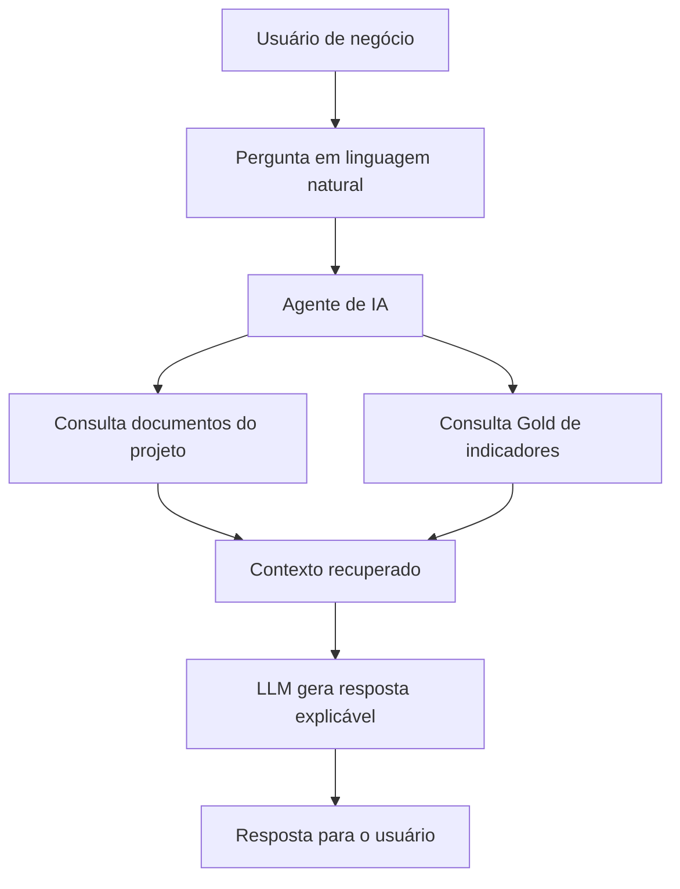

# Desenho da Camada de IA e Agente RAG

Este documento descreve a proposta de uma futura camada de Inteligência Artificial para o projeto **AI-Powered Payment Reminder & Delinquency Prevention Platform**.

A ideia é usar a camada Gold e a documentação do projeto como base para um agente de IA capaz de responder perguntas de negócio, explicar regras de classificação e apoiar análises sobre clientes, risco e priorização de contato.

---

## 1. Objetivo da Camada de IA

A camada de IA tem como objetivo transformar os dados e regras do projeto em uma experiência mais simples para usuários de negócio.

Em vez de o usuário precisar consultar tabelas, dashboards ou código, ele poderia fazer perguntas em linguagem natural, como:

```text
Por que este cliente foi classificado como alto_risco?
```

```text
Quais clientes devem receber lembrete preventivo reforçado?
```

```text
Quantos clientes priorizados não possuem cadastro?
```

```text
Quais regras foram usadas para definir prioridade_contato?
```

O agente responderia usando as informações da camada Gold e da documentação do projeto.

---

## 2. Fontes de Informação do Agente

O agente poderá usar duas fontes principais:

| Fonte              | Uso                                                                                |
| ------------------ | ---------------------------------------------------------------------------------- |
| Dados estruturados | Consultar métricas, clientes, risco, prioridade, ação recomendada e canal sugerido |
| Documentação       | Explicar regras, conceitos, campos, decisões de modelagem e limitações             |

---

## 3. Fonte Estruturada Principal

A principal tabela estruturada para o agente será a Gold:

```text
data/gold/gold_indicadores_cliente.parquet
```

Granularidade:

```text
1 linha = 1 cliente com histórico de pagamento
```

Essa tabela contém os principais indicadores de negócio:

```text
id_cliente
nivel_risco
perfil_pagamento
taxa_atraso_pct
maior_atraso_dias
prioridade_contato
flg_priorizar_contato
acao_recomendada
grupo_negocio
canal_sugerido
status_cadastro
valor_previsto_total_priorizado
```

---

## 4. Documentos que Podem Alimentar o RAG

Além da Gold, o agente poderá consultar documentos explicativos do projeto.

Documentos principais:

```text
docs/03_dicionario_dados.md
docs/05_metricas_gold.md
docs/07_mapeamento_perguntas_negocio.md
docs/08_etapas_pipeline.md
docs/09_dicionario_gold_indicadores_cliente.md
docs/10_regras_negocio_priorizacao.md
```

Esses documentos ajudam o agente a responder não apenas “quanto” ou “quem”, mas também “por quê”.

---

## 5. O Que é RAG Neste Projeto

RAG significa **Retrieval-Augmented Generation**, ou geração aumentada por recuperação.

Neste projeto, isso significa que o agente não responderia apenas com base no conhecimento geral do modelo.

Ele primeiro buscaria informações nos documentos e/ou na Gold, e depois geraria uma resposta explicável.

Fluxo simplificado:

```text
Pergunta do usuário
↓
Busca nos documentos e/ou na Gold
↓
Recuperação dos trechos relevantes
↓
Geração da resposta pela IA
↓
Resposta explicada em linguagem de negócio
```

---

## 6. Exemplos de Perguntas Respondidas com a Gold

### Pergunta 1

```text
Quantos clientes são de alto risco?
```

Fonte provável:

```text
gold_indicadores_cliente.parquet
```

Campo usado:

```text
nivel_risco
```

Resposta esperada:

```text
Existem 37.193 clientes classificados como alto_risco.
```

---

### Pergunta 2

```text
Quantos clientes devem ser priorizados para contato?
```

Fonte provável:

```text
gold_indicadores_cliente.parquet
```

Campo usado:

```text
flg_priorizar_contato
```

Resposta esperada:

```text
Existem 129.478 clientes priorizados para contato.
```

---

### Pergunta 3

```text
Quais clientes devem receber lembrete preventivo reforçado?
```

Fonte provável:

```text
gold_indicadores_cliente.parquet
```

Campo usado:

```text
acao_recomendada
```

Filtro:

```text
acao_recomendada = lembrete_preventivo_reforcado
```

Resposta esperada:

```text
Clientes classificados com acao_recomendada igual a lembrete_preventivo_reforcado devem receber comunicação mais forte, pois estão associados ao grupo de alto risco.
```

---

## 7. Exemplos de Perguntas Respondidas com Documentação

### Pergunta 1

```text
Como o projeto calcula atraso?
```

Fonte provável:

```text
docs/10_regras_negocio_priorizacao.md
```

Resposta esperada:

```text
O atraso é calculado pela diferença entre dias_pagamento_ref e dias_previsto_ref. Quando o resultado é maior que zero, o pagamento é considerado atrasado.
```

Regra:

```text
dif_dias_vencimento = dias_pagamento_ref - dias_previsto_ref
```

---

### Pergunta 2

```text
Por que um cliente vira alto_risco?
```

Fonte provável:

```text
docs/10_regras_negocio_priorizacao.md
```

Resposta esperada:

```text
Um cliente é classificado como alto_risco quando possui taxa de atraso maior ou igual a 30% ou quando seu maior atraso histórico é maior ou igual a 30 dias.
```

---

### Pergunta 3

```text
Por que existem clientes sem cadastro na Gold?
```

Fonte provável:

```text
docs/05_metricas_gold.md
docs/09_dicionario_gold_indicadores_cliente.md
```

Resposta esperada:

```text
A Gold parte dos clientes com histórico de pagamento e faz enriquecimento com cadastro usando LEFT JOIN. Por isso, clientes que possuem comportamento de pagamento, mas não aparecem na base cadastral, são mantidos e sinalizados como cliente_sem_cadastro.
```

---

## 8. Arquitetura Conceitual da Camada de IA



---

## 9. Componentes Possíveis

Uma futura implementação poderia conter:

| Componente           | Função                                                  |
| -------------------- | ------------------------------------------------------- |
| Base documental      | Armazenar os documentos `.md` do projeto                |
| Base vetorial        | Indexar os documentos para busca semântica              |
| Consulta estruturada | Consultar a Gold por filtros, agregações e métricas     |
| LLM                  | Gerar respostas em linguagem natural                    |
| Camada de segurança  | Evitar exposição indevida de dados sensíveis            |
| Interface            | Permitir interação via chat, dashboard ou aplicação web |

---

## 10. Possível Stack Técnica

Uma implementação futura poderia usar:

| Tecnologia              | Possível uso                        |
| ----------------------- | ----------------------------------- |
| Python                  | Orquestração do agente              |
| Pandas ou DuckDB        | Consulta local à Gold               |
| LangChain ou LlamaIndex | Construção do fluxo RAG             |
| Chroma ou FAISS         | Base vetorial local                 |
| OpenAI API              | Modelo de linguagem                 |
| Streamlit               | Interface simples para demonstração |
| Power BI                | Dashboard executivo                 |
| GitHub                  | Versionamento do projeto            |

---

## 11. Tipos de Resposta Esperados

O agente poderia responder diferentes tipos de pergunta.

### Respostas de métrica

Exemplo:

```text
Quantos clientes são de medio_risco?
```

Resposta:

```text
Existem 92.276 clientes classificados como medio_risco.
```

---

### Respostas explicativas

Exemplo:

```text
O que significa prioridade_maxima?
```

Resposta:

```text
prioridade_maxima indica clientes de alto risco cujo maior atraso histórico foi igual ou superior a 30 dias.
```

---

### Respostas de recomendação

Exemplo:

```text
O que fazer com clientes de alto_risco?
```

Resposta:

```text
Clientes de alto_risco devem receber lembrete_preventivo_reforcado, pois apresentam atraso frequente ou severo.
```

---

### Respostas de rastreabilidade

Exemplo:

```text
De qual tabela vem o campo canal_sugerido?
```

Resposta:

```text
O campo canal_sugerido é criado na Gold, a partir da disponibilidade de informações cadastrais na Silver de clientes.
```

---

## 12. Campos Importantes Para o Agente

Campos da Gold que podem ser usados em perguntas:

| Campo                             | Uso no agente                              |
| --------------------------------- | ------------------------------------------ |
| `id_cliente`                      | Identificar cliente                        |
| `nivel_risco`                     | Explicar classificação de risco            |
| `perfil_pagamento`                | Explicar comportamento histórico           |
| `taxa_atraso_pct`                 | Quantificar frequência de atraso           |
| `media_dias_atraso`               | Explicar atraso médio                      |
| `maior_atraso_dias`               | Explicar severidade do atraso              |
| `prioridade_contato`              | Explicar urgência de contato               |
| `flg_priorizar_contato`           | Identificar clientes priorizados           |
| `acao_recomendada`                | Sugerir ação de negócio                    |
| `canal_sugerido`                  | Sugerir canal de contato                   |
| `status_cadastro`                 | Explicar cobertura cadastral               |
| `grupo_negocio`                   | Agrupar clientes por finalidade de negócio |
| `valor_previsto_total_priorizado` | Medir valor associado aos priorizados      |

---

## 13. Regras Que o Agente Deve Saber Explicar

O agente deve conseguir explicar:

* como o atraso é calculado;
* o que significa pagamento antecipado, no prazo e em atraso;
* como o perfil de pagamento é definido;
* como o nível de risco é definido;
* como a prioridade de contato é definida;
* como a ação recomendada é definida;
* por que clientes sem cadastro foram mantidos;
* quais campos devem ser usados no Power BI;
* quais limitações existem no projeto.

---

## 14. Exemplo de Resposta Explicável

Pergunta:

```text
Por que o cliente foi classificado como alto_risco?
```

Resposta esperada:

```text
O cliente foi classificado como alto_risco porque apresentou comportamento histórico de atraso considerado severo. Pela regra de negócio do projeto, um cliente entra em alto_risco quando possui taxa de atraso maior ou igual a 30% ou quando seu maior atraso histórico é maior ou igual a 30 dias. Para confirmar o motivo exato, devem ser consultados os campos taxa_atraso_pct e maior_atraso_dias na tabela gold_indicadores_cliente.
```

---

## 15. Limitações da Camada de IA

A camada de IA não deve ser tratada como fonte absoluta de decisão automática.

Pontos de atenção:

* o agente deve responder com base nos dados e regras disponíveis;
* a classificação atual é baseada em regras de negócio, não em modelo preditivo supervisionado;
* antes de qualquer envio real de mensagem, seria necessário validar regras com negócio, jurídico, privacidade e canais;
* a IA deve explicar a recomendação, não substituir a decisão da área responsável;
* dados sensíveis de clientes devem ser tratados com segurança e governança.

---

## 16. Possíveis Evoluções

Evoluções futuras:

* criar um chatbot local para consultar a Gold;
* criar busca semântica nos documentos `.md`;
* integrar o agente com o dashboard Power BI;
* criar respostas automáticas sobre métricas da carteira;
* criar análise individual por cliente;
* criar score preditivo de atraso;
* comparar regra de negócio com modelo de machine learning;
* gerar explicações automáticas para clientes priorizados;
* criar simulações de campanhas de lembrete.

---

## 17. Conclusão

A camada de IA/RAG é uma evolução natural do projeto.

A Gold organiza os dados para análise e decisão.
A documentação explica as regras e decisões.
O agente de IA pode unir essas duas partes para responder perguntas em linguagem natural, com rastreabilidade e explicabilidade.

Com isso, o projeto deixa de ser apenas um pipeline de dados e passa a representar uma solução analítica com potencial de apoio inteligente à área de negócio.
